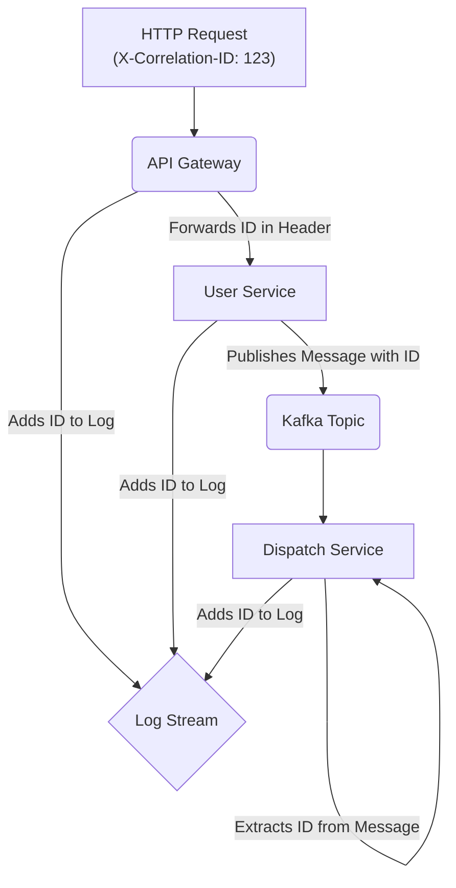

<p align="center">
  
</p>

<h1 align="center">SyntropyLog</h1>

<p align="center">
  <strong>The Observability Framework for High-Performance Teams.</strong>
  <br />
  Ship resilient, secure, and cost-effective Node.js applications with confidence.
</p>

<p align="center">
  <a href="https://www.npmjs.com/package/syntropylog"></a>
  <a href="https://github.com/Syntropysoft/SyntropyLog/blob/main/LICENSE"></a>
  <a href="#"></a>
</p>

# SyntropyLog
[](https://shields.io/)

**The Observability Framework for High-Performance Teams.**
Ship resilient, secure, and cost-effective Node.js applications with confidence.

> **🚀 BETA VERSION - READY FOR PRODUCTION** 🚀
> 
> **SyntropyLog is now in BETA phase (0.6.10).**
> 
> - **Core features stable**: Logger, context, HTTP, Redis, brokers (tested & proven)
> - **Production ready**: 94.1% test coverage, comprehensive examples
> - **API stable**: Core functionality locked, backward compatible
> - **Ready for adoption**: Perfect for production applications

> ## 🚀 Project Status: Beta Version 0.6.10 🚀
>
> **SyntropyLog is production-ready with comprehensive test coverage and working examples.**
>
> The core API is stable with **94.1% test coverage** across **616+ tests**. All core features are tested, working, and ready for production use.
>
> ### 🎯 Latest Achievements (0.6.10)
> - **🔥 Hot Configuration**: New `reconfigureLoggingMatrix()` method for dynamic log verbosity control
> - **🔒 Security & Compliance**: Clear documentation of what can/cannot be changed dynamically
> - **📚 Enhanced Examples**: Examples 04-08 now demonstrate core framework concepts clearly
> - **✅ Comprehensive Testing**: 94.1% test coverage with 616 tests including new functionality
> - **🎯 Framework-Focused Learning**: Examples teach SyntropyLog, not enterprise infrastructure
> - **🚀 Production Ready**: All core features tested and stable for production use
> - **📦 Robust Build System**: Rollup configuration with proper bundle generation (~145KB bundle size)
> - **🔄 Universal Context Patterns**: Consistent context management across all Node.js application types
> - **🎨 Multiple Transport Support**: Pretty and JSON transports working simultaneously
> - **⚡ Dynamic Configuration**: Log levels and logging matrix can be changed at runtime safely
>
> **Why This Matters**: Developers can confidently adopt SyntropyLog for production applications. Clear learning path with working examples. Honest assessment of framework capabilities.

---

## The SyntropyLog Advantage: A Framework for Every Role

<details>
<summary><strong>For the Developer: An Effortless Experience</strong></summary>

> "I just want to get my work done. I need tools that are simple, powerful, and don't get in my way."

-   **Fluent & Agnostic API**: Use a clean, unified API (`.getHttp()`, `.getBroker()`) for all your external communications. Switch from `axios` to `fetch` or from Kafka to RabbitMQ by changing one line in the configuration, not your application code.
-   **Zero Boilerplate**: The `correlationId` is propagated automatically. The logger is context-aware. You just call `logger.info()` and the hard work is done for you.
-   **Rich Testability**: With built-in mocks and spy transports, writing meaningful tests for your instrumentation is trivial, not a chore.
-   **Comprehensive Type Safety**: Full TypeScript support with detailed type definitions and IntelliSense support.

</details>

<details>
<summary><strong>For the Tech Lead: Instant, End-to-End Clarity</strong></summary>

> "When something breaks at 2 AM, I need to find the root cause in minutes, not hours. I need to see the whole story."

-   **Automatic Distributed Tracing**: SyntropyLog automatically injects and retrieves a `correlationId` across service boundaries. A single ID connects a user's request from your API gateway, through your services, and across your message queues.
-   **Structured & Actionable Logs**: All logs are JSON-structured for powerful querying. Contextual information (service name, HTTP method, broker topic) is added automatically, turning ambiguous log messages into clear, actionable data.
-   **Robust Pipeline Architecture**: The logging pipeline includes serialization, masking, and context management, ensuring consistent and secure log output across your entire application.



</details>

<details>
<summary><strong>For the Manager & DevOps: Ship with Confidence & Control</strong></summary>

> "I need to ensure our systems are secure, compliant, and cost-effective. Surprises are not an option."

-   **Declarative Log Scoping with Logging Matrix**: Stop paying to ingest verbose logs that you don't need. With the `loggingMatrix`, you can declaratively define *exactly* what parts of the context get logged for each severity level. Keep success logs lean and cheap, while capturing the full, rich context when an error occurs.
    ```typescript
    // In your config:
    loggingMatrix: {
      default: ['correlationId'], // Keep it minimal for info, debug, etc.
      error: ['*'],               // Log everything on error.
      fatal: ['*']
    }
    ```
-   **🩺 Experimental Doctor CLI**: The `syntropylog doctor` validates SyntropyLog configurations (experimental, in development).
-   **Security by Default**: A powerful, zero-dependency masking engine automatically finds and redacts sensitive data like `"password"` or `"creditCardNumber"` at any level of your log objects, ensuring you stay compliant.
-   **Production-Ready Transports**: Multiple transport options including JSON for production tools and human-readable formats for development environments.
-   **Configuration Validation**: Built-in validation ensures your configuration is correct and follows best practices.
</details>

---

## ⚡ Quick Start

> **⚠️ ALPHA VERSION**: This example uses `syntropylog@0.6.9`. For production use, wait for stable release.

### 🚀 Basic Configuration (Get Started in 30 Seconds)

The simplest way to get started with SyntropyLog:

```typescript
import { syntropyLog } from 'syntropylog';

// Initialize with minimal configuration
await syntropyLog.init({
  logger: {
    serviceName: 'my-app',
    level: 'info',
  },
});

// Use it immediately
const logger = syntropyLog.getLogger();
logger.info('Hello, SyntropyLog!');
```

### 🔧 Standard Configuration (Most Common Use Case)

For most applications, you'll want HTTP instrumentation and context management:

```typescript
import { syntropyLog, PrettyConsoleTransport } from 'syntropylog';
import { AxiosAdapter } from '@syntropylog/adapters';
import axios from 'axios';

await syntropyLog.init({
  logger: {
    level: 'info',
    serviceName: 'my-app',
    transports: [new PrettyConsoleTransport()], // Human-readable for dev
  },
  // Smart context logging: minimal by default, verbose on errors
  loggingMatrix: {
    default: ['correlationId'],
    error: ['*'], // '*' means log the entire context
    fatal: ['*'],
  },
  context: {
    correlationIdHeader: 'X-Correlation-ID',
  },
  http: {
    instances: [
      {
        instanceName: 'myApi',
        adapter: new AxiosAdapter(axios.create({ baseURL: 'https://api.example.com' })),
      },
    ],
  },
});

// Use the instrumented client and logger
const apiClient = syntropyLog.getHttp('myApi');
const logger = syntropyLog.getLogger();

async function main() {
    // Add extra data to the context for this specific operation
    syntropyLog.getContextManager().set('userId', 123);

    logger.info('Fetching user data...'); // Will only have `correlationId` in the context
    
    try {
      await apiClient.request({
        method: 'GET',
        url: '/users/1/posts',
      });
    } catch (err) {
      // This log will contain the full context, including `userId`, because the level is 'error'.
      logger.error({ err }, 'Failed to fetch posts');
    }
}

main();
```

### 🦚 Complete Configuration Reference (Show Off Mode)

Ready to see the full power of SyntropyLog? Here's every configuration option available:

```typescript
import { syntropyLog, PrettyConsoleTransport, ClassicConsoleTransport } from 'syntropylog';
import { AxiosAdapter, FetchAdapter } from '@syntropylog/adapters';
import { KafkaAdapter, NatsAdapter, RabbitMQAdapter } from '@syntropylog/adapters';
// Note: Serializers are available in the separate @syntropylog/adapters package
import axios from 'axios';

await syntropyLog.init({
  // 🎯 Logger Configuration
  logger: {
    name: 'my-custom-logger',
    level: 'info', // 'fatal' | 'error' | 'warn' | 'info' | 'debug' | 'trace' | 'silent'
    serviceName: 'my-enterprise-app',
    transports: process.env.NODE_ENV !== 'production' 
      ? [new PrettyConsoleTransport()] // Human-readable for development
      : [
          new ClassicConsoleTransport(), // JSON for production
          new CustomDataDogTransport(), // Custom transport for DataDog
          new KafkaLogTransport({ // Send logs to Kafka for aggregation
            brokers: ['log-kafka:9092'],
            topic: 'application-logs',
          }),
          // You can create custom transports for any logging service
          // new ElasticsearchTransport({ url: 'http://elasticsearch:9200' }),
          // new SplunkTransport({ token: process.env.SPLUNK_TOKEN }),
          // new OpenTelemetryTransport({ // 🚧 Coming Soon
          //   endpoint: 'http://otel-collector:4317',
          //   serviceName: 'my-enterprise-app',
          //   serviceVersion: '1.0.0',
          // }),
        ],
    // Note: Custom serializers for complex objects
    // user: (user) => `${user.id}:${user.email}`,
    // request: (req) => `${req.method} ${req.url}`,
    serializerTimeoutMs: 50, // Prevent slow serializers from blocking
    prettyPrint: {
      enabled: process.env.NODE_ENV !== 'production',
    },
  },

  // 🧠 Smart Context Logging Matrix
  loggingMatrix: {
    default: ['correlationId', 'serviceName'], // Minimal context for success logs
    trace: ['*'], // Full context for debugging
    debug: ['correlationId', 'userId', 'operation'],
    info: ['correlationId', 'serviceName'],
    warn: ['correlationId', 'userId', 'errorCode'],
    error: ['*'], // Full context when things go wrong
    fatal: ['*'], // Everything for critical failures
  },

  // 🌐 HTTP Client Configuration
  http: {
    instances: [
      {
        instanceName: 'userApi',
        adapter: new AxiosAdapter(axios.create({ 
          baseURL: 'https://api.users.com',
          timeout: 5000,
        })),
        isDefault: true,
        propagate: ['correlationId', 'userId', 'tenantId'], // Custom context propagation
        logging: {
          onSuccess: 'debug', // Log successful requests at debug level
          onError: 'error',
          logSuccessBody: false, // Don't log response bodies
          logSuccessHeaders: false,
          onRequest: 'info',
          logRequestBody: true, // Log request bodies for debugging
          logRequestHeaders: false,
        },
      },
      {
        instanceName: 'paymentApi',
        adapter: new FetchAdapter(), // Use native fetch
        propagate: ['correlationId', 'paymentId'],
        logging: {
          onSuccess: 'info',
          onError: 'warn',
          logSuccessBody: true, // Log payment responses
          logRequestHeaders: true, // Log auth headers
        },
      },
    ],
    default: 'userApi',
  },

  // 📡 Message Broker Configuration
  brokers: {
    instances: [
      {
        instanceName: 'events',
        adapter: new KafkaAdapter({
          brokers: ['localhost:9092'],
          clientId: 'my-app',
        }),
        propagate: ['correlationId', 'userId', 'eventType'],
      },
      {
        instanceName: 'notifications',
        adapter: new NatsAdapter({
          servers: ['nats://localhost:4222'],
        }),
        propagate: ['*'], // Propagate all context
      },
      {
        instanceName: 'orderProducer',
        adapter: new RabbitMQAdapter({
          url: 'amqp://localhost:5672',
          exchange: 'orders',
          routingKey: 'order.created',
        }),
        propagate: ['correlationId', 'userId', 'orderId'],
      },
      {
        instanceName: 'orderConsumer',
        adapter: new RabbitMQAdapter({
          url: 'amqp://localhost:5672',
          queue: 'order-processing',
          exchange: 'orders',
          routingKey: 'order.created',
        }),
        propagate: ['correlationId', 'orderId', 'processorId'],
      },
      {
        instanceName: 'analyticsCluster',
        adapter: new RabbitMQAdapter({
          urls: [
            'amqp://rabbit1:5672',
            'amqp://rabbit2:5672',
            'amqp://rabbit3:5672',
          ],
          exchange: 'analytics',
          routingKey: 'data.processed',
        }),
        propagate: ['correlationId', 'dataType', 'processedAt'],
      },
    ],
    default: 'events',
  },

  // 🗄️ Redis Configuration
  redis: {
    instances: [
      {
        instanceName: 'cache',
        mode: 'single',
        url: 'redis://localhost:6379',
        retryOptions: {
          maxRetries: 3,
          retryDelay: 1000,
        },
        logging: {
          onSuccess: 'debug',
          onError: 'error',
          logCommandValues: true, // Log Redis commands
          logReturnValue: false, // Don't log return values
        },
      },
      {
        instanceName: 'session',
        mode: 'sentinel',
        name: 'mymaster',
        sentinels: [
          { host: 'sentinel1', port: 26379 },
          { host: 'sentinel2', port: 26379 },
        ],
        sentinelPassword: 'secret',
        logging: {
          onSuccess: 'trace', // Very detailed logging
          onError: 'fatal',
          logCommandValues: false, // Don't log session data
          logReturnValue: false,
        },
      },
      {
        instanceName: 'analytics',
        mode: 'cluster',
        rootNodes: [
          { host: 'cluster1', port: 7000 },
          { host: 'cluster2', port: 7000 },
        ],
      },
    ],
    default: 'cache',
  },

  // 🔒 Data Masking Configuration
  masking: {
    fields: [
      'password',
      'creditCard',
      'ssn',
      /token/i, // Regex for any field containing 'token'
      /secret/i,
    ],
    maskChar: '*',
    maxDepth: 3, // Don't mask deeper than 3 levels
    style: 'fixed', // 'fixed' | 'preserve-length'
  },

  // 🔗 Context Propagation Configuration
  context: {
    correlationIdHeader: 'X-Correlation-ID',
    transactionIdHeader: 'X-Trace-ID',
  },

  // ⏱️ Shutdown Configuration
  shutdownTimeout: 10000, // 10 seconds for graceful shutdown

  // 🩺 Doctor CLI Configuration
  doctor: {
    disableRules: ['rule-id-1', 'rule-id-2'], // Disable specific validation rules
  },
});

### 🩺 **Doctor CLI: Flexible Configuration Validator**

The SyntropyLog Doctor is a **flexible configuration validator** that can validate any configuration files using customizable rules. It comes with built-in rules for SyntropyLog but is completely configurable for any validation needs.

#### **Core Capabilities:**
- ✅ **Flexible Configuration Validation**: Validates any YAML/JSON configuration files
- ✅ **Customizable Rules**: Use built-in rules, create your own, or mix both
- ✅ **Environment-Specific Rules**: Different validation rules for different environments
- ✅ **Multi-File Auditing**: Analyze multiple configurations with different rule sets
- ✅ **CI/CD Integration**: Proper exit codes for pipeline integration

#### **Built-in SyntropyLog Rules (Optional):**
1. **Production Logger Level Check**: Warns if logger level is too verbose in production
2. **Logger Transports Validation**: Errors if no logger transports are defined
3. **Data Masking Rules Check**: Warns if no sensitive data protection is configured
4. **Redis Configuration Validation**: Errors for invalid Redis sentinel configurations
5. **Redis Instance Name Uniqueness**: Errors for duplicate Redis instance names

> **Note**: These rules are optional. You can use them, ignore them, or replace them entirely with your own custom rules.

#### **Usage:**
```bash
# Validate a single configuration file (uses local rules or core rules)
syntropylog doctor syntropylog.config.yaml

# Run comprehensive audit across multiple files with different rule sets
syntropylog audit

# Initialize custom rules manifest
syntropylog init --rules

# Initialize audit plan for multiple files
syntropylog init --audit
```

#### **Rule Customization Examples:**

**1. Use all core rules plus custom ones:**
```typescript
// syntropylog.doctor.ts
import { coreRules } from 'syntropylog/doctor';

export default [
  ...coreRules,
  {
    id: 'my-custom-rule',
    description: 'My custom validation rule',
    check: (config) => { /* your logic */ return []; }
  }
];
```

**2. Filter out specific core rules:**
```typescript
// syntropylog.doctor.ts
import { coreRules } from 'syntropylog/doctor';

export default coreRules.filter(rule => rule.id !== 'prod-log-level');
```

**3. Replace all core rules with your own:**
```typescript
// syntropylog.doctor.ts
export default [
  {
    id: 'my-rule-1',
    description: 'Custom rule 1',
    check: (config) => { /* your logic */ return []; }
  },
  {
    id: 'my-rule-2', 
    description: 'Custom rule 2',
    check: (config) => { /* your logic */ return []; }
  }
];
```

**4. Different rules for different environments:**
```typescript
// syntropylog.audit.ts
import { coreRules } from 'syntropylog/doctor';

export default [
  {
    name: 'Production Config',
    configFile: './config/production.yaml',
    rules: [...coreRules, ...productionRules] // All rules for production
  },
  {
    name: 'Development Config', 
    configFile: './config/development.yaml',
    rules: coreRules.filter(r => r.id !== 'prod-log-level') // Less strict for dev
  }
];
```

#### **🎯 Current Focus:**
- ✅ **Configuration Validation**: Comprehensive validation of your SyntropyLog setup
- ✅ **Flexible Rules**: Custom validation rules for your specific needs
- ✅ **Immediate Feedback**: Instant identification of configuration issues
- ✅ **Best Practices**: Built-in rules for common configuration patterns
- ✅ **Extensible System**: Add your own validation rules as needed

> **Note**: The doctor focuses on **ensuring your SyntropyLog configuration is correct and follows best practices**. Advanced analysis features (performance, security, patterns) are planned for future versions.
```

### 🎯 What This Configuration Gives You

- **🔍 Granular Logging Control**: Different log levels for different operations
- **🛡️ Security by Default**: Automatic masking of sensitive data
- **🌐 Multi-Client Support**: HTTP, Redis, and message brokers with custom adapters
- **📡 Multi-Broker Architecture**: Kafka, NATS, and RabbitMQ with producer/consumer patterns
- **📊 Context-Aware Logging**: Smart context inclusion based on log level
- **🚀 Environment-Aware Transports**: Different logging strategies for dev vs production
- **⚡ Performance Optimization**: Configurable timeouts and retry strategies
- **🔧 Framework Agnostic**: Works with any HTTP client, database, or message broker
- **🩺 Experimental Diagnostics**: Doctor CLI for configuration validation (experimental, in development)
- **🏗️ Scalable Architecture**: Support for clusters, sentinels, and distributed systems

### 🎭 Logger API Showcase

See the full power of the fluent logger API:

```typescript
// Get the logger instance
const logger = syntropyLog.getLogger('user-service');

// Basic logging with context
logger.info('User logged in successfully');

// Fluent API with source and transaction tracking
logger
  .withSource('auth-controller')
  .withTransactionId('tx-12345')
  .withRetention('audit') // Special retention for compliance
  .info('User authentication completed', { 
    userId: 123, 
    method: 'oauth2',
    provider: 'google' 
  });

// Error logging with full context
logger
  .withSource('payment-processor')
  .withTransactionId('tx-67890')
  .error({ err: paymentError }, 'Payment processing failed', {
    orderId: 'ord-456',
    amount: 99.99,
    currency: 'USD'
  });

// Debug with custom context
logger
  .withSource('cache-manager')
  .debug('Cache miss for user profile', {
    cacheKey: 'user:123:profile',
    ttl: 3600,
    hitRate: 0.85
  });

// Fatal with retention and source
logger
  .withSource('database-connection')
  .withRetention('permanent') // Never delete these logs
  .fatal('Database connection pool exhausted', {
    activeConnections: 100,
    maxConnections: 100,
    queueLength: 50
  });

// Trace with detailed context
logger
  .withSource('sql-query')
  .trace('Executing complex query', {
    query: 'SELECT * FROM users WHERE status = ? AND created_at > ?',
    params: ['active', '2024-01-01'],
    executionTime: 45.2
  });
```

### 🛡️ Security Features

#### 📋 **Retention Rules (Experimental)**

SyntropyLog provides flexible retention policies with JSON-based configuration (experimental feature):

```typescript
// Retention Configuration Enums - Type-safe compliance rules
enum Duration {
  TEMPORARY = '7d',    // 7 days
  STANDARD = '30d',    // 30 days
  ARCHIVE = '1y',      // 1 year
  AUDIT = '7y',        // 7 years
  FOREVER = 'forever'  // Never delete
}

enum Compliance {
  BASIC = 'basic',
  SOX = 'SOX',         // Sarbanes-Oxley
  SEC = 'SEC',         // Securities and Exchange Commission
  GDPR = 'GDPR',       // General Data Protection Regulation
  PCI_DSS = 'PCI-DSS', // Payment Card Industry
  HIPAA = 'HIPAA'      // Health Insurance Portability
}

enum Encryption {
  AES_128 = 'AES-128',
  AES_256 = 'AES-256',
  FIPS_140_2 = 'FIPS-140-2'
}

enum Backup {
  STANDARD = 'standard',
  GEO_REDUNDANT = 'geo-redundant',
  MULTI_REGION = 'multi-region'
}

enum Access {
  READ_WRITE = 'read-write',
  READ_ONLY = 'read-only',
  RESTRICTED = 'restricted'
}

enum Audit {
  NONE = 'none',
  BASIC = 'basic',
  FULL_TRAIL = 'full-trail'
}

enum Legal {
  NONE = 'none',
  HOLD = 'hold',
  LITIGATION = 'litigation'
}

// Retention Policy Enum - Predefined JSON configurations
enum RetentionPolicy {
  STANDARD = {
    duration: Duration.STANDARD,
    compliance: Compliance.BASIC,
    encryption: Encryption.AES_128
  },
  AUDIT = {
    duration: Duration.AUDIT,
    compliance: Compliance.SOX,
    encryption: Encryption.AES_256,
    audit: Audit.FULL_TRAIL
  },
  PERMANENT = {
    duration: Duration.FOREVER,
    compliance: Compliance.SEC,
    encryption: Encryption.FIPS_140_2,
    legal: Legal.HOLD
  },
  TEMPORARY = {
    duration: Duration.TEMPORARY,
    compliance: Compliance.BASIC,
    encryption: Encryption.AES_128,
    deletion: 'automatic'
  },
  ARCHIVE = {
    duration: Duration.ARCHIVE,
    compliance: Compliance.BASIC,
    encryption: Encryption.AES_256,
    backup: Backup.STANDARD
  }
}

// Usage with predefined JSON enum
logger
  .withRetention(RetentionPolicy.AUDIT)  // ✅ Valid - 7 years retention with SOX compliance
  .info('Sensitive audit log');

// Usage with custom JSON configuration using enums
logger
  .withRetention({
    duration: Duration.AUDIT,           // 7 years
    compliance: Compliance.SOX,         // SOX compliance
    encryption: Encryption.AES_256,     // Encrypted storage
    backup: Backup.GEO_REDUNDANT,       // Geographic redundancy
    access: Access.READ_ONLY           // Immutable after creation
  })
  .info('Financial transaction log');

// ⚠️ IMPORTANT: JSON is completely flexible - no field restrictions!
// You can use any JSON structure, nested objects, arrays, etc.
logger
  .withRetention({
    // Custom fields - no restrictions
    myCustomField: 'any value',
    nestedObject: {
      level1: {
        level2: {
          level3: 'deep nesting is allowed'
        }
      }
    },
    arrayOfValues: ['item1', 'item2', 'item3'],
    complexStructure: {
      rules: {
        retention: '7y',
        encryption: 'AES-256',
        customFlags: {
          audit: true,
          backup: 'geo-redundant',
          compliance: ['SOX', 'GDPR']
        }
      }
    }
  })
  .info('Log with completely custom retention configuration');

// More custom retention examples
logger
  .withRetention({
    duration: Duration.STANDARD,        // 30 days (custom 90d would need string)
    compliance: Compliance.GDPR,        // GDPR compliance
    anonymization: 'after-30d',         // Anonymize after 30 days
    deletion: 'automatic'               // Auto-delete after duration
  })
  .info('User data log');

logger
  .withRetention({
    duration: Duration.FOREVER,         // Never delete
    compliance: Compliance.SEC,         // SEC compliance
    encryption: Encryption.FIPS_140_2,  // FIPS encryption
    audit: Audit.FULL_TRAIL,           // Full audit trail
    legal: Legal.HOLD                  // Legal hold
  })
  .fatal('Security incident log');
```

#### 🔒 **Security & Validation**

**Text-Only Validation**: All log messages are validated as plain text for security:

```typescript
// ✅ Valid - Plain text messages
logger.info('User authentication successful');
logger.error('Database connection failed');

// ✅ Valid - JSON objects (automatically serialized to text)
logger.info('User data', { userId: 123, email: 'user@example.com' });

// ✅ Valid - Complex objects (serialized safely)
logger.error('API Error', { 
  error: new Error('Network timeout'),
  context: { requestId: 'req-123', endpoint: '/api/users' }
});

// ❌ Invalid - HTML/Script injection attempts are blocked
logger.info('<script>alert("xss")</script>');  // Throws validation error
logger.error('User input: ${userInput}');      // Sanitized automatically
```

#### 🛡️ **Compliance Standards (Estándares de Cumplimiento)**

SyntropyLog supports major compliance standards with built-in configurations:

```typescript
// SOX Compliance - Financial reporting
logger
  .withRetention({
    duration: Duration.AUDIT,        // 7 years retention
    compliance: Compliance.SOX,      // Sarbanes-Oxley Act
    encryption: Encryption.AES_256,  // Strong encryption
    audit: Audit.FULL_TRAIL         // Complete audit trail
  })
  .info('Financial transaction processed');

// GDPR Compliance - Data privacy
logger
  .withRetention({
    duration: Duration.STANDARD,     // 30 days (configurable)
    compliance: Compliance.GDPR,     // General Data Protection Regulation
    anonymization: 'after-30d',      // Auto-anonymize personal data
    deletion: 'automatic'            // Right to be forgotten
  })
  .info('User data accessed');

// PCI-DSS Compliance - Payment security
logger
  .withRetention({
    duration: Duration.AUDIT,        // 7 years for payments
    compliance: Compliance.PCI_DSS,  // Payment Card Industry
    encryption: Encryption.AES_256,  // Card data encryption
    access: Access.RESTRICTED        // Restricted access
  })
  .info('Payment card processed');

// SEC Compliance - Securities trading
logger
  .withRetention({
    duration: Duration.FOREVER,      // Permanent retention
    compliance: Compliance.SEC,      // Securities and Exchange Commission
    encryption: Encryption.FIPS_140_2, // FIPS encryption
    legal: Legal.HOLD               // Legal hold capability
  })
  .fatal('Trading anomaly detected');
```

#### 📊 **Flexible Format Support**

```typescript
// Text format (default)
logger.info('Simple text message');

// JSON format (automatic)
logger.info('Structured data', { 
  event: 'user_login',
  timestamp: Date.now(),
  metadata: { browser: 'Chrome', os: 'macOS' }
});

// Mixed format (text + context)
logger.error('Operation failed', { 
  operation: 'database_query',
  duration: 1500,
  error: 'Connection timeout'
});
```

#### 📝 **JSON Flexibility Notes**

- **✅ Standard JSON Values**: Only primitive values (string, number, boolean, null)
- **✅ No Field Restrictions**: Use any JSON structure you want
- **✅ Nested Objects**: Deep nesting is fully supported (recursive)
- **✅ Arrays**: Include arrays of any valid JSON type
- **✅ Custom Fields**: Add your own fields alongside standard ones
- **✅ Mixed Types**: Combine strings, numbers, booleans, objects, arrays
- **✅ Dynamic Structure**: Change structure per log entry if needed
- **✅ Type Safety**: Full TypeScript validation with recursive types

```typescript
// Examples of flexible JSON usage with all primitive types:
.withRetention({
  // String values
  duration: '7y',
  algorithm: 'AES-256',
  
  // Number values
  ttl: 2555,
  version: 2024,
  keyRotation: 90,
  
  // Boolean values
  enabled: true,
  audit: false,
  
  // Null values
  metadata: null,
  
  // Nested object with mixed types
  compliance: {
    standard: 'SOX',
    version: 2024,
    active: true,
    requirements: ['audit', 'encryption', 'backup']
  },
  
  // Array of objects with mixed types
  rules: [
    { type: 'retention', value: '7y', enabled: true, priority: 1 },
    { type: 'encryption', value: 'AES-256', level: 256, active: true },
    { type: 'backup', value: 'geo-redundant', frequency: 24, enabled: false }
  ],
  
  // Deep nesting with all primitive types
  enterprise: {
    policies: {
      security: {
        encryption: {
          algorithm: 'AES-256',
          keyRotation: 90,
          enabled: true,
          metadata: null,
          levels: [128, 256, 512],
          flags: {
            fips: true,
            quantum: false,
            legacy: null
          }
        }
      }
    }
  }
})
```


## 🔌 External Adapters

SyntropyLog provides a rich ecosystem of external adapters for various databases, HTTP clients, and message brokers. These adapters are available as a separate package for maximum flexibility.

### Quick Install
```bash
npm install @syntropylog/adapters
```

### Available Adapters
- **HTTP Clients**: Axios, Fetch (with custom adapter support)
- **Message Brokers**: Kafka, NATS, RabbitMQ ✅ (tested in examples 20-24)
- **Database Serializers**: Prisma, TypeORM, MySQL, PostgreSQL (community help needed)

### Usage Example
```typescript
import { syntropyLog } from 'syntropylog';
import { AxiosAdapter } from '@syntropylog/adapters';

// Use adapters independently
const axiosAdapter = new AxiosAdapter(axios.create());
```

**[📖 Full Adapters Documentation](https://github.com/Syntropysoft/syntropylog-adapters)**

---

## 📂 Learn by Example

The best way to learn SyntropyLog is to see it in action. We have a comprehensive collection of examples in our dedicated examples repository.

Each example is a self-contained project that demonstrates a specific feature, from data masking to building a fully correlated full-stack application.

**[➡️ Explore the Examples](https://github.com/Syntropysoft/syntropylog-examples-)**

### 🎯 Featured: Framework Agnosticism Demo

**Examples 12 & 13** demonstrate SyntropyLog's framework agnostic design:

- **Example 12**: HTTP + Redis + Express - Production-ready caching system
- **Example 13**: HTTP + Redis + Fastify - Same functionality, different framework

**Key Benefits:**
- ✅ **Same business logic** - ProductDataService identical in both
- ✅ **Framework agnostic** - SyntropyLog works seamlessly across frameworks  
- ✅ **Performance comparison** - Fastify 2x faster than Express
- ✅ **Redis integration** - Automatic caching with 1-2ms operations
- ✅ **Complete documentation** - Real logs and working commands

**[🚀 Try the Framework Agnosticism Demo](https://github.com/Syntropysoft/syntropylog-examples-/tree/main/13-http-redis-fastify)**

### Example Categories:

#### **Foundation (00-09)**
- **00-setup-initialization**: ✅ **Complete** - Application setup and initialization
- **01-hello-world**: ✅ **Complete** - Basic logging concepts
- **02-basic-context**: ✅ **Complete** - Context propagation and correlation
- **03-context-ts**: ✅ **Complete** - TypeScript interfaces and type safety
- **04-logging-levels-transports**: ✅ **Complete** - Logging levels and transport configuration
- **05-universal-context-patterns**: 🚧 **In Development** - Universal context patterns for all Node.js applications
- **06-error-handling**: 🚧 **In Development** - Error handling and logging strategies
- **07-logger-configuration**: 🚧 **In Development** - Advanced logger configuration patterns
- **08-logging-matrix**: 🚧 **In Development** - Smart context logging matrix
- **09-http-configuration**: 🚧 **In Development** - HTTP client configuration patterns

#### **HTTP Clients & Redis (10-19)**
- **10-basic-http-correlation**: ✅ **Complete** - HTTP request correlation with automatic context propagation
- **11-custom-adapter**: ✅ **Complete** - Custom HTTP adapters for framework-agnostic design
- **12-http-redis-axios**: ✅ **Complete** - HTTP + Redis + Express with caching
- **13-http-redis-fastify**: ✅ **Complete** - Framework agnosticism demo (Express vs Fastify)
- **14-http-redis-nestjs**: 🚧 **In Development** - NestJS framework integration
- **15-http-redis-koa**: 🚧 **In Development** - Koa framework integration
- **16-http-redis-hapi**: 🚧 **In Development** - Hapi framework integration
- **17-custom-serializers**: 🚧 **In Development** - Custom data serialization patterns
- **18-custom-transports**: 🚧 **In Development** - Custom logging transport patterns
- **19-doctor-cli**: 🚧 **In Development** - Configuration validation with Doctor CLI

#### **Message Brokers (20-24) ✅ COMPLETE**
- **20-basic-kafka-correlation**: ✅ **Tested with Docker** - Kafka message broker integration
- **21-basic-rabbitmq-broker**: ✅ **Tested with Docker** - RabbitMQ integration
- **22-basic-nats-broker**: ✅ **Tested with Docker** - NATS integration
- **23-kafka-full-stack**: ✅ **Complete** - Kafka distributed tracing
- **24-full-stack-nats**: ✅ **Complete** - Advanced NATS microservices architecture

#### **Advanced Patterns (25-29) 🚧 IN DEVELOPMENT**
- **25-production-configuration**: 🚧 **In Development** - Production-ready configuration patterns
- **26-advanced-context**: 🚧 **In Development** - Advanced context management patterns
- **27-complete-enterprise-app**: 🚧 **In Development** - Complete enterprise application example


#### **Specialized Features (14-16) 🚧 IN DEVELOPMENT**
- **14-redis-configuration**: 🚧 **In Development** - Advanced Redis configuration patterns
- **15-message-brokers-configuration**: 🚧 **In Development** - Message broker configuration patterns
- **16-data-masking**: 🚧 **In Development** - Data masking and security patterns

---

## 🧪 Testing & Quality

SyntropyLog is built with quality and reliability in mind:

- **94.04% Test Coverage** across 604+ tests
- **45 Test Files** covering all major components
- **Integration Tests** for end-to-end scenarios
- **Comprehensive Mock System** for easy testing
- **Type Safety** with full TypeScript support

Run the test suite:
```bash
npm test                    # Unit tests
npm run test:integration    # Integration tests
npm run test:coverage       # Coverage report
```

---

## 🛠️ Development

### Project Structure

SyntropyLog is organized into multiple repositories:

- **`syntropyLog/`**: Main library source code and tests
- **[`syntropylog-examples-`](https://github.com/Syntropysoft/syntropylog-examples-)**: Complete examples demonstrating framework features
- **[`syntropylog-adapters-`](https://github.com/Syntropysoft/syntropylog-adapters)**: External adapters for HTTP clients and message brokers

### Prerequisites
- Node.js 18+
- npm or yarn

### Setup
```bash
git clone https://github.com/Syntropysoft/SyntropyLog.git
cd syntropylog
npm install
```

### Build
```bash
npm run build              # Build library and types
npm run build:types        # Generate type definitions only
```

### Development Workflow
```bash
npm run dev                # Start development mode
npm run lint               # Run linter
npm run format             # Format code
```

---

## 📦 Installation

> **🚀 BETA VERSION - READY FOR PRODUCTION** 🚀
> 
> **SyntropyLog is now in BETA phase (0.6.10).**
> 
> - **Production ready** for core features
> - **API stable** and backward compatible
> - **Ready for adoption** in production applications
> - **Examples require beta version: `syntropylog@0.6.10`**

```bash
npm install syntropylog@0.6.10
```

## 🔌 Supported Dependencies

SyntropyLog includes built-in adapters for popular libraries. Here are the supported versions:

### HTTP Clients
- **Axios**: `^1.10.0` ✅ **Built-in adapter**
- **Fetch**: Native browser API ✅ **Custom adapter support**
- **Custom Adapters**: Support for any HTTP client via adapter pattern

### Message Brokers
- **Kafka**: `kafkajs ^2.2.4` ✅ **Tested in examples 20, 23**
- **RabbitMQ**: `amqplib ^0.10.8` ✅ **Tested in example 21**
- **NATS**: `nats ^2.17.0` ✅ **Tested in examples 22, 24**

### Database Serializers (Community Help Needed)
- **Prisma**: Available in `@syntropylog/adapters` package
- **TypeORM**: Available in `@syntropylog/adapters` package
- **MySQL**: Available in `@syntropylog/adapters` package
- **PostgreSQL**: Available in `@syntropylog/adapters` package

### Usage Example
```typescript
import { syntropyLog } from 'syntropylog';
import { AxiosAdapter } from '@syntropylog/adapters';
import axios from 'axios';

// Use the AxiosAdapter from the adapters package
const adapter = new AxiosAdapter(axios.create({ 
  baseURL: 'https://api.example.com' 
}));
```

## 📄 License

This project is licensed under the Apache License 2.0 - see the [LICENSE](LICENSE) file for details.

## 🤝 Contributing

We welcome contributions! Please see our [Contributing Guide](CONTRIBUTING.md) for details.

## 📞 Support

- 📖 [Documentation](./docs/)
- 🐛 [Issues](https://github.com/Syntropysoft/SyntropyLog/issues)
- 💬 [Discussions](https://github.com/Syntropysoft/SyntropyLog/discussions)
