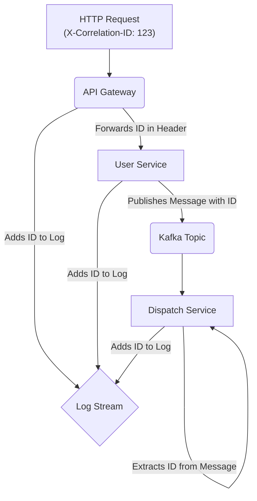

<p align="center">
  
</p>

<h1 align="center">SyntropyLog</h1>

<p align="center">
  <strong>The Observability Framework for High-Performance Teams.</strong>
  <br />
  Ship resilient, secure, and cost-effective Node.js applications with confidence.
</p>

<p align="center">
  <a href="https://github.com/Syntropysoft/SyntropyLog/actions/workflows/ci.yml"></a>
  <a href="https://www.npmjs.com/package/syntropylog"></a>
  <a href="https://github.com/Syntropysoft/SyntropyLog/blob/main/LICENSE"></a>
  <a href="#"></a>
</p>

# SyntropyLog
[](https://shields.io/)

**The Observability Framework for High-Performance Teams.**
Ship resilient, secure, and cost-effective Node.js applications with confidence.

> ## 🚀 Project Status: Beta Version 🚀
>
> **SyntropyLog has reached a stable beta phase with comprehensive test coverage and production-ready architecture.**
>
> The core API is stable and well-tested with **95.6% test coverage** across **530+ tests**. The framework is ready for production use with proper configuration and monitoring.
>
> We continue to add features and improvements based on community feedback. Your contributions and feedback are welcome!

---

## The SyntropyLog Advantage: A Framework for Every Role

<details>
<summary><strong>For the Developer: An Effortless Experience</strong></summary>

> "I just want to get my work done. I need tools that are simple, powerful, and don't get in my way."

-   **Fluent & Agnostic API**: Use a clean, unified API (`.getHttp()`, `.getBroker()`) for all your external communications. Switch from `axios` to `fetch` or from Kafka to RabbitMQ by changing one line in the configuration, not your application code.
-   **Zero Boilerplate**: The `correlationId` is propagated automatically. The logger is context-aware. You just call `logger.info()` and the hard work is done for you.
-   **Rich Testability**: With built-in mocks and spy transports, writing meaningful tests for your instrumentation is trivial, not a chore.
-   **Comprehensive Type Safety**: Full TypeScript support with detailed type definitions and IntelliSense support.

</details>

<details>
<summary><strong>For the Tech Lead: Instant, End-to-End Clarity</strong></summary>

> "When something breaks at 2 AM, I need to find the root cause in minutes, not hours. I need to see the whole story."

-   **Automatic Distributed Tracing**: SyntropyLog automatically injects and retrieves a `correlationId` across service boundaries. A single ID connects a user's request from your API gateway, through your services, and across your message queues.
-   **Structured & Actionable Logs**: All logs are JSON-structured for powerful querying. Contextual information (service name, HTTP method, broker topic) is added automatically, turning ambiguous log messages into clear, actionable data.
-   **Robust Pipeline Architecture**: The logging pipeline includes serialization, masking, and context management, ensuring consistent and secure log output across your entire application.



</details>

<details>
<summary><strong>For the Manager & DevOps: Ship with Confidence & Control</strong></summary>

> "I need to ensure our systems are secure, compliant, and cost-effective. Surprises are not an option."

-   **Declarative Log Scoping with Logging Matrix**: Stop paying to ingest verbose logs that you don't need. With the `loggingMatrix`, you can declaratively define *exactly* what parts of the context get logged for each severity level. Keep success logs lean and cheap, while capturing the full, rich context when an error occurs.
    ```typescript
    // In your config:
    loggingMatrix: {
      default: ['correlationId'], // Keep it minimal for info, debug, etc.
      error: ['*'],               // Log everything on error.
      fatal: ['*']
    }
    ```
-   **Automated Governance with Doctor CLI**: The `syntropylog doctor` is your automated gatekeeper for CI/CD. It validates configurations *before* deployment, preventing costly mistakes like overly verbose logging in production (saving on ingestion costs) or insecure setups.
-   **Tame Your ORMs with Custom Serializers**: Stop leaking data or polluting logs with massive objects. Define a serializer once for your `Prisma` or `TypeORM` models to ensure that only clean, safe data is ever logged.
-   **Security by Default**: A powerful, zero-dependency masking engine automatically finds and redacts sensitive data like `"password"` or `"creditCardNumber"` at any level of your log objects, ensuring you stay compliant.
-   **Production-Ready Transports**: Multiple transport options including JSON for production tools and human-readable formats for development environments.
</details>

---

## ⚡ Quick Start

This example shows how to initialize the logger and make an instrumented HTTP request.

```typescript
import { syntropyLog, PrettyConsoleTransport, AxiosAdapter } from 'syntropylog';
import axios from 'axios';

// 1. Configure SyntropyLog once in your application's entry point.
syntropyLog.init({
  logger: {
    level: 'info',
    serviceName: 'my-app',
    transports: [new PrettyConsoleTransport()], // Human-readable for dev
  },
  // Define what context gets logged. Keep it minimal by default, but verbose on error.
  loggingMatrix: {
    default: ['correlationId'],
    error: ['*'], // '*' means log the entire context
    fatal: ['*'],
  },
  context: {
    correlationIdHeader: 'X-Correlation-ID',
  },
  http: {
    instances: [
      {
        instanceName: 'myApi',
        adapter: new AxiosAdapter(axios.create({ baseURL: 'https://api.example.com' })),
      },
    ],
  },
});

// 2. Get the instrumented client and logger anywhere you need them.
const apiClient = syntropyLog.getHttp('myApi');
const logger = syntropyLog.getLogger();

// 3. Use them. The framework handles the rest.
async function main() {
    // Add extra data to the context for this specific operation
    syntropyLog.getContextManager().set('userId', 123);

    logger.info('Fetching user data...'); // Will only have `correlationId` in the context
    
    try {
      await apiClient.request({
        method: 'GET',
        url: '/users/1/posts',
      });
    } catch (err) {
      // This log will contain the full context, including `userId`, because the level is 'error'.
      logger.error({ err }, 'Failed to fetch posts');
    }
}

main();
```

---

## 📂 Learn by Example

The best way to learn SyntropyLog is to see it in action. We have a comprehensive collection of examples in the `/examples` directory.

Each example is a self-contained project that demonstrates a specific feature, from data masking to building a fully correlated full-stack application.

**[➡️ Explore the Examples](./examples/README.md)**

### Example Categories:
- **01-hello-world**: Basic logger setup
- **10-basic-context**: Context management fundamentals  
- **20-context-ts**: TypeScript context examples
- **30-data-masking**: Security and data protection
- **40-basic-http-correlation**: HTTP request correlation
- **50-basic-kafka-correlation**: Message broker correlation
- **70-full-stack-correlation**: Complete distributed tracing
- **90-compliance-retention**: Log retention and compliance
- **100-custom-serializers**: Custom data serialization
- **110-diagnostics-doctor**: Configuration validation

---

## 🧪 Testing & Quality

SyntropyLog is built with quality and reliability in mind:

- **95.6% Test Coverage** across 530+ tests
- **42 Test Files** covering all major components
- **Integration Tests** for end-to-end scenarios
- **Comprehensive Mock System** for easy testing
- **Type Safety** with full TypeScript support

Run the test suite:
```bash
npm test                    # Unit tests
npm run test:integration    # Integration tests
npm run test:coverage       # Coverage report
```

---

## 🛠️ Development

### Prerequisites
- Node.js 18+
- npm or yarn

### Setup
```bash
git clone https://github.com/Syntropysoft/SyntropyLog.git
cd syntropylog
npm install
```

### Build
```bash
npm run build              # Build library and types
npm run build:types        # Generate type definitions only
```

### Development Workflow
```bash
npm run dev                # Start development mode
npm run lint               # Run linter
npm run format             # Format code
```

---

## 📦 Installation

```bash
npm install syntropylog
```

## 📄 License

This project is licensed under the MIT License - see the [LICENSE](LICENSE) file for details.

## 🤝 Contributing

We welcome contributions! Please see our [Contributing Guide](CONTRIBUTING.md) for details.

## 📞 Support

- 📖 [Documentation](./docs/)
- 🐛 [Issues](https://github.com/Syntropysoft/SyntropyLog/issues)
- 💬 [Discussions](https://github.com/Syntropysoft/SyntropyLog/discussions)
