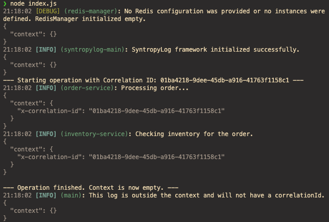
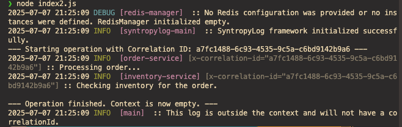
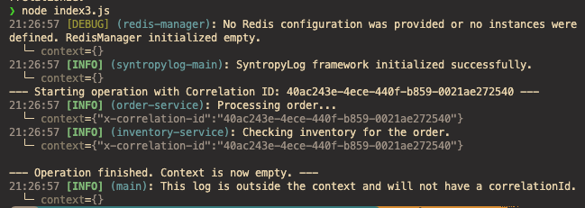
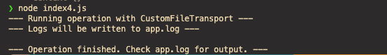
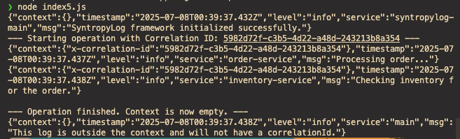
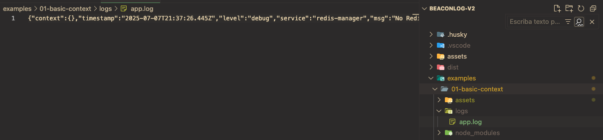

# SyntropyLog Example: Context & Custom Transports

This example demonstrates the core features of `syntropyLog`, including automatic context propagation and the flexibility of its transport system.

It includes six different entry points, each showcasing a different way to format and output logs.

## Prerequisites

Before running this example, you must first build the main `syntropylog` library from the project's root directory:

```bash
# From the project root
npm run build
```

This step ensures that the local `syntropylog` dependency used by this example is up-to-date. After building, you can proceed with installing the example's dependencies.

## How to Run

1.  **Install dependencies:**
    ```bash
    npm install
    ```

2.  **Run the different examples:**

    * **For a rich, detailed, multi-line output (great for deep inspection):**
        ```bash
        node index.js
        ```
        

    * **For a classic, single-line, text-based format (Log4j style):**
        ```bash
        node index2.js
        ```

        

    * **For a compact, developer-friendly, single-line metadata format:**
        ```bash
        node index3.js
        ```

    

    * **To see a custom file transport in action:**
        ```bash
        node index4.js
        ```

      

      file: app.log

   ```JSON
   {"context":{},"timestamp":"2025-07-08T00:33:27.665Z","level":"debug","service":"redis-manager","msg":"No Redis configuration was provided or no instances were defined. RedisManager initialized empty."}
   {"context":{},"timestamp":"2025-07-08T00:33:27.668Z","level":"info","service":"syntropylog-main","msg":"SyntropyLog framework initialized successfully."}
   {"sku":"SYN-001","stock":42,"context":{"x-correlation-id":"0831c1b7-c5f5-4172-a247-b86fcf032513"},"timestamp":"2025-07-08T00:33:27.671Z","level":"info","service":"inventory-service","msg":"Checking inventory for the order."}
   {"product":"SyntropyBook","quantity":1,"context":{"x-correlation-id":"0831c1b7-c5f5-4172-a247-b86fcf032513"},"timestamp":"2025-07-08T00:33:27.671Z","level":"info","service":"order-service","msg":"Processing order..."}
   {"context":{},"timestamp":"2025-07-08T00:33:27.673Z","level":"info","service":"syntropylog-main","msg":"Shutting down SyntropyLog framework..."}
   {"context":{},"timestamp":"2025-07-08T00:33:27.673Z","level":"info","service":"redis-manager","msg":"Cerrando todas las conexiones de Redis..."}
   {"context":{},"timestamp":"2025-07-08T00:33:27.673Z","level":"info","service":"syntropylog-main","msg":"SyntropyLog shut down successfully."}
   {"context":{},"timestamp":"2025-07-08T00:33:27.673Z","level":"info","service":"redis-manager","msg":"Todas las conexiones de Redis han sido cerradas."}
   ```


   * **For production-ready, raw JSON output:**
        ```bash
        node index5.js
        ```

      

   * **For advanced file logging with rotation:**
        ```bash
        node index6.js
        ```
        


## Understanding the Examples

---

## Advanced Extensibility

### `index4.js`: Creating Your Own Basic Transport

SyntropyLog is designed to be extensible. Creating a custom transport is incredibly simple. All you need to do is extend the base `Transport` class and implement the `async log(entry)` method. This example demonstrates a `CustomFileTransport` that writes every log as a JSON line to an `app.log` file.

```javascript
// In index4.js
import { Transport } from 'syntropylog';
import fs from 'fs';

class CustomFileTransport extends Transport {
  async log(entry) {
    const logString = JSON.stringify(entry) + '\\n';
    fs.appendFile('app.log', logString, (err) => {
      if (err) console.error('Failed to write to log file', err);
    });
  }
}
```

### `index6.js`: Composition with Specialized Libraries (Log Rotation)

A core philosophy of SyntropyLog is to do one thing perfectly—generating and processing logs—and to compose well with other tools. Instead of building complex features like log rotation into the core, we encourage composing `syntropylog` with specialized libraries.

This example shows how to use the popular `rotating-file-stream` library to create a robust file transport.

```javascript
// In index6.js
import { Transport } from 'syntropylog';
import * as rfs from 'rotating-file-stream';

// 1. Create a rotating stream that handles size, interval, and compression.
const stream = rfs.createStream('app.log', {
  size: '1M',
  interval: '1d',
  compress: 'gzip',
  path: './logs'
});

// 2. Our transport is now extremely simple: it just writes to a stream.
class WritableStreamTransport extends Transport {
  constructor(writeStream) { 
    super();
    // Assign the stream to a class property
    this.writeStream = writeStream;
  }
  
  async log(entry) {
    this.writeStream.write(JSON.stringify(entry) + '\\n');
  }
}

// 3. In init(), we compose them.
await syntropyLog.init({
  logger: {
    transports: [new WritableStreamTransport(stream)],
  },
});
```

This pattern is powerful: it keeps SyntropyLog lean and allows developers to choose the best-in-class tools for specific tasks like file rotation, without the framework imposing its own implementation.
